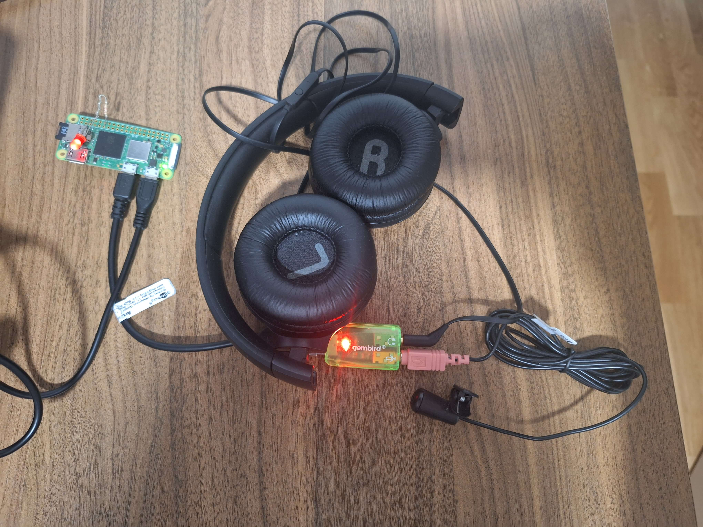

# rpiclaw - Raspberry Pi Zero 2W AI assistant

Proof-of-concept AI assitant using Raspberry Pi Zero 2W, [PicoClaw](https://github.com/sipeed/picoclaw), speech-to-text (STT) and text-to-speech (TTS), currently both realized using Google Web Speech API.
USB sound card is used to connect microphone and speakers to the rpi.
For demo purposes, LED via resistor is connected to GPIO 17 of the rpi which can be controlled with the AI agent.



## Prerequisite

- Install Raspberry Pi OS Lite (64-bit)
- After successful boot of the rpi, update the packages and then install the following new packages:
```
sudo apt update && sudo apt upgrade -y
sudo apt install zram-tools  # enables ZRAM
sudo apt install libportaudio2 libportaudiocpp0 portaudio19-dev libasound-dev libsndfile1-dev sox -y  # required for audio
sudo apt install gpiod  # for gpio control
```

## PicoClaw setup

1. Install PicoClaw, prebuilt binaries are available on [GitHub](https://github.com/sipeed/picoclaw/releases/latest)
2. Add PicoClaw executable to `PATH` environment variable, using `.bashrc` for example:
```
export PATH=/path/to/picoclaw:$PATH
```
3. Init PicoClaw workspace using `picoclaw onboard`, which creates the PicoClaw workspace under `/home/<USER>/.picoclaw`
4. Create account on [OpenRouter](https://openrouter.ai/) and create API key. The usage is small and adding $10 credits is enough for experimentation.
5. Use the `/home/<USER>/.picoclaw/config.json` to configure PicoClaw.
Available configs can be checked in the PicoClaw repo, currently at [`config/config.example.json`](https://github.com/sipeed/picoclaw/blob/main/config/config.example.json).
Basically, we need to specify the LLM that will be used, any tools that we want PicoClaw to use, like web search, weather check, etc., and configure chat channels (telegram, whatsapp, etc.).
This is the config file used in this POC.
Check the PicoClaw readme to see how to [configure telegram channel](https://github.com/sipeed/picoclaw?tab=readme-ov-file#-chat-apps).
```
{
  "agents": {
    "defaults": {
      "workspace": "~/.picoclaw/workspace",
      "model": "google/gemini-3-flash-preview",
      "max_tokens": 8192,
      "temperature": 0.7,
      "max_tool_iterations": 20
    }
  },
  "providers": {
    "openrouter": {
      "api_key": "<OPENROUTER_API_KEY>",
      "api_base": "https://openrouter.ai/api/v1"
    }
  },
  "tools": {
    "web": {
      "duckduckgo": {
        "enabled": true,
        "max_results": 5
      }
    }
  },
  "channels": {
    "telegram": {
      "enabled": true,
      "token": "<TELEGRAM_BOT_TOKEN>",
      "allowFrom": ["<TELEGRAM_USER_ID>"]
    }
  }
}
```

To use PicoClaw using telegram, run the following command to start the gateway first:
```
picoclaw gateway
```

Additionally, PicoClaw can be used with single message instantations:
```
picoclaw agent -m "Message..."
```

### Adding PicoClaw skill to control LED

To be able to control the LED using PicoClaw, we need to create new skill.
Some official documentation for skills can be found on the original project, which inspired PicoClaw, [OpenClaw](https://docs.openclaw.ai/tools/skills).

To create the LED control skill:
1. Create new directory `light` under `/home/<USER>/.picoclaw/workspace/skill` directory.
2. Add script called `control.sh` in the `light` directory with the following content:
```
#!/bin/bash
# Usage: ./control.sh on|off

PIN=17
STATE=$1

if [ "$STATE" == "on" ]; then
    pinctrl set $PIN op dh
    echo "LIGHT_ON"
elif [ "$STATE" == "off" ]; then
    pinctrl set $PIN op dl
    echo "LIGHT_OFF"
else
    echo "Unknown state: $STATE"
    exit 1
fi
```
3. Add `SKILL.md` file in the `light` directory, which is telling the agent how to use the skill:
~~~
---
name: light
description: Controls the physical light (turn on/off).
---

# Lamp Control

Use this skill when the user wants to turn the light on or off.

## Capabilities
- Turn light on
- Turn light off

## Implementation

To control the light, you must execute the following shell command using your `run_shell` or `bash` tool:

```bash
/home/<USER>/.picoclaw/workspace/skills/light/control.sh <state>
```
~~~

To test the skill:
```
picoclaw agent -m "turn the light on"
```

The LED should turn on.

## Voice commands and response

As PicoClaw can be interfaced with text, we will need to use speech-to-text conversion to convert user voice requests to text, and we will need to use text-to-speech conversion to convert PicoClaw responses to sound.

For this purposes, we can use the Google Web Speech API, the easiest way to do this is in Python, with 2 libraries:
- [SpeechRecognition](https://github.com/Uberi/speech_recognition), for the STT part, and
- [gTTS](https://gtts.readthedocs.io/en/latest/), for the TTS part.

The python project is managed with [uv](https://docs.astral.sh/uv/) and available in this repo.
Run `uv sync` to init the project.

To run the project, use `uv run main.py`.
The script runs endless loop:
1. Listens for the wake work (default it is 'nexus').
2. Uses `SpeechRecognition` to convert the voice command to text.
3. Runs `picoclaw agent -m <COMMAND>`.
4. The output from `picoclaw` is passed to `gTTS` to generate sound, in mp3 format.
5. The mp3 is replayed.